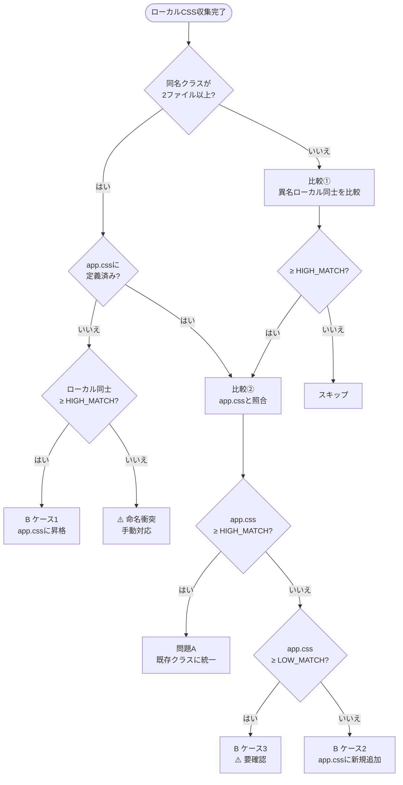

# /css-unify — CSS クラス共通化

Blade ビューと `resources/css/app.css` を横断スキャンし、以下の3種類の問題を検出・修正する。

1. **統一問題 (A)**: カスタムクラスをセマンティッククラスへ書き換えるべき箇所
2. **抽出問題 (B)**: 複数ファイルで繰り返されるスタイル群を新規共通クラスとして定義すべき箇所
3. **未使用問題 (C)**: 定義されているが使われていないクラス
   - **C-1**: `app.css` に定義されているが Blade で未使用（全ファイルスキャン時のみ）
   - **C-2**: `<style>` タグに定義されているが同ファイル内の HTML で未使用

**前提:** セマンティッククラスとは `resources/css/app.css` に定義された共通クラスを指す（`btn-primary`・`form-control`・`badge-*` 等）。

---

## パラメータ

> 閾値を変更したい場合はここだけ編集する。

| パラメータ | 値 | 適用箇所 |
|---|---|---|
| `HIGH_MATCH` | **80%** | 問題A判定 / 比較① / ケース1検出 / 命名衝突の境界 |
| `LOW_MATCH`  | **50%** | ケース2 / ケース3の境界 |

---

## ステップ 1: app.css の読み込み

`resources/css/app.css` を読み込み、以下を把握する。

- 定義されているセマンティッククラス名の一覧
- 各クラスのプロパティ（後述の重複検出に使う）

---

## ステップ 2: Blade ファイルのスキャン

`resources/views/` 以下の全 `.blade.php` を読み込む。
ただし `resources/views/components/` 内はスキャン対象から除外する。

引数でファイルパスが指定された場合はそのファイルのみをスキャンする。

各ファイルから以下を **2種類** 収集する。

**① クラス使用箇所（HTML 属性）**
- `class="..."` 属性に含まれる全クラス名・タグ種別・行番号

**② `<style>` タグ内の CSS 定義**
- クラス名・プロパティ一覧・定義元ファイル名を収集し、「ファイルローカル CSS 定義」として扱う

```
収集例 (products/index.blade.php の <style> タグより):
  .prd-header    → { display:flex; align-items:center; justify-content:space-between; margin-bottom:1.5rem }
  .submit-btn--primary → { background:#4f46e5; color:#fff }
```

---

## ステップ 3: 問題の検出

### 検出フロー



### 全ケース判定表

| # | 入力条件 | 出力 | レポート出力先 | 推奨対応 |
|---|---|---|---|---|
| 1 | 1ファイルのみ + app.css と ≥ HIGH_MATCH | **問題A** | セクションA | app.css クラスに統一 |
| 2 | 同名が2ファイル以上 + app.css 定義済み + ≥ HIGH_MATCH | **問題A**（比較②経由） | セクションA | app.css クラスに統一 |
| 3 | 同名が2ファイル以上 + app.css 未定義 + ≥ HIGH_MATCH | **B ケース1** | セクションB | app.css に昇格 |
| 4 | 同名が2ファイル以上 + app.css 未定義 + < HIGH_MATCH | **⚠️ 命名衝突** | セクションB | 手動対応 |
| 5 | 異名が2ファイル以上 + ローカル同士 ≥ HIGH_MATCH + app.css ≥ HIGH_MATCH | **問題A**（比較②経由） | セクションA | app.css クラスに統一 |
| 6 | 異名が2ファイル以上 + ローカル同士 ≥ HIGH_MATCH + app.css LOW_MATCH〜HIGH_MATCH | **B ケース3** | セクションB | ⚠️ 要確認（3択） |
| 7 | 異名が2ファイル以上 + ローカル同士 ≥ HIGH_MATCH + app.css < LOW_MATCH or 対応なし | **B ケース2** | セクションB | app.css に新規追加 |
| 8 | app.css にあるが全 Blade で未使用（全スキャン時のみ） | **C-1** | セクションC | app.css から削除 |
| 9 | `<style>` タグに定義されているが同ファイル内の HTML で未使用 | **C-2** | セクションC | `<style>` タグから削除 |

### 一致率の計算方法（比較②: app.css 基準）

```
一致率 = (app.css クラスのプロパティのうち、共通プロパティと一致する数)
       ÷ (app.css クラスの総プロパティ数)
```

app.css 側に余分なプロパティがある場合は一致率が下がる。これにより「置き換えると見た目が変わるリスク」が反映される。

```
例:
  共通プロパティ:        display / align-items / justify-content  （3個）
  app.css .page-header: display / align-items / justify-content / padding  （4個）
  一致率 = 3 ÷ 4 = 75% → ケース3（⚠️ 要確認）
```

### 統一先の判断基準（問題A で複数候補が競合する場合）

以下を優先順位順に適用する。

1. **app.css に定義されているクラスを優先**: `<style>` タグ内のクラスは置き換え候補
2. **役割ベースの名前を優先**: `btn-primary`（役割）> `submit-btn--primary`（見た目+役割混在）
3. **一致度が高い方を優先**: プロパティが完全一致 → 自動統一 / 微差あり → `⚠️ 要確認` フラグ

### 問題C — 未使用クラス

**C-1: app.css 未使用クラス**

> **引数指定時はスキップ**: C-1 は全ファイルスキャン時のみ実行する。

`app.css` に定義されているが `resources/views/` 以下のいずれの Blade ファイル（components/ 除く）にも登場しないクラスを検出する。

**C-2: ローカル `<style>` 未使用クラス**

スキャン対象の各ファイルについて以下の手順で検出する（引数指定時・全スキャン時ともに実行）。

1. `<style>` タグ内で定義されているクラス名を収集する（疑似セレクタ `:hover`・`:focus` 等は除去してベースクラス名を取得）
2. 同ファイルの HTML 内の `class="..."` 属性に現れるクラス名を収集する
3. 手順1にあって手順2にないクラス → **C-2**（削除候補）として記録する

> **注意**: `@include` で読み込まれる子テンプレートからの参照は検出できない。子テンプレートが同じクラスを使っている可能性がある場合は `⚠️ 要確認` フラグを立てること。

---

## ステップ 4: 差分レポートの出力

検出結果を以下のフォーマットで出力する。**この時点ではファイルを一切変更しない。**

### セクション A: 統一すべきクラス

> 判定表 #1・#2・#5 に該当するものをここに出力する。

```
## A. カスタムクラス → セマンティッククラスへの統一候補

| # | 現在のクラス | 推奨クラス | 出現ファイル | 出現箇所 | 判定根拠 |
|---|------------|----------|------------|---------|---------|
| 1 | search-input | form-control | products/index, customers/index | input[name=search] × 2 | app.css で同等スタイル定義済み |
```

### セクション B: 新規共通クラスの抽出候補

> 判定表 #3・#4・#6・#7 に該当するものをここに出力する。

```
## B. 新規共通クラスの抽出候補

| # | ケース | クラス名 | 推奨新クラス名 | 使用ファイル数 | app.css との一致率 | 推奨対応 |
|---|--------|---------|------------|-------------|-----------------|---------|
| 2 | ケース1    | .action-btn       | action-btn（そのまま） | 3ファイル | —（未定義） | app.css に昇格 |
| 3 | ケース2    | .prd-header / .wh-header | .page-header（提案） | 2ファイル | 40% | app.css に新規追加 |
| 4 | ケース3    | .prd-header / .wh-header | —                  | 2ファイル | 75% | ⚠️ 要確認 |
| — | ⚠️ 命名衝突 | .list-footer      | —                  | 2ファイル | —（未定義） | 手動対応 |
```

### セクション C: 未使用クラス（削除候補）

> C-1 は全ファイルスキャン時のみ出力する。C-2 は引数指定時・全スキャン時ともに出力する。

```
## C. 未使用クラス（削除候補）

### C-1. app.css の未使用クラス（全スキャン時のみ）

| # | クラス名 | app.css 行 | 備考 |
|---|---------|-----------|------|
| 5 | .old-header-style | 42行 | スキャン対象全ファイルで未使用 |

### C-2. <style> タグ内の未使用クラス

| # | クラス名 | ファイル | 備考 |
|---|---------|---------|------|
| 6 | .prd-empty | products/index.blade.php | 同ファイル内の HTML で未使用 |
| 7 | .btn-set   | products/show.blade.php  | ⚠️ 要確認（@include 先での使用の可能性あり） |
```

---

## ステップ 5: ユーザーに適用する番号を確認する

AskUserQuestion ツールを使い、以下を質問する。

- **質問**: 「適用する変更の番号を選んでください（複数選択可）」
- **選択肢**: 候補ごとに1つのオプション（「# 番号: 内容の要約」）
- **multiSelect: true**

**ケース2（判定表 #7）が選択された場合の追加確認:**

- **質問**: 「`{ローカルクラス名一覧}` をまとめる新しい共通クラス名を決めてください（提案: `{AIが提案するクラス名}`）」

**ケース3（判定表 #6）が選択された場合の追加確認:**

- **質問**: 「`{ローカルクラス名}` と app.css の `{app.cssクラス名}` の差異（{差異の内容}）についてどう対応しますか？」
- **選択肢**:
  - `app.css 側を修正`: app.css のプロパティをローカルに合わせて変更し、ローカル定義を削除する
  - `ローカルを修正`: ローカルの `<style>` 定義を削除し、class= 属性で app.css のクラスを使用する
  - `別クラスとして残す`: 統一せず、ローカル定義をそのまま維持する

---

## ステップ 6: 選択された変更を適用する

### 6-1. Blade ファイルの書き換え

**class= 属性の置き換え（問題A / ケース2 / ケース3「ローカルを修正」）:**
- `class="..."` 内の対象クラス名だけを置き換える（他のクラスは残す）
- `class="{{ ... }}"` などの動的クラスは内容を確認してから置き換える

```blade
{{-- 変換前 --}}
<input type="text" name="search" class="search-input">

{{-- 変換後 --}}
<input type="text" name="search" class="form-control">
```

**`<style>` タグ定義の削除（ケース1・ケース2 / ケース3「ローカルを修正」または「app.css 側を修正」/ C-2）:**
- app.css に移行したクラス、および C-2 で選択された未使用クラスの定義を `<style>` タグから削除する
- `<style>` タグ内の残りの定義がなくなった場合はタグごと削除する

### 6-2. app.css の更新

以下を順番に実施する。

**手順1. 不要クラスの削除（問題A で統一されたクラスが app.css にある場合）**
- 削除前にスキャン対象外のファイルで使われていないか確認し、懸念がある場合はユーザーに確認する

**手順2. 新規共通クラスの追加（ケース1・ケース2 で新規定義が必要な場合）**
- 関連する既存クラスの近くに追加し、コメントを1行記載する（`/* css-unify: 複数画面共通 */`）

**手順3. 未使用クラスの削除（C-1 で削除候補が選択された場合）**
- 削除前にスキャン対象外のファイルで使われていないか確認し、懸念がある場合はユーザーに確認する

**手順4. ケース3「app.css 側を修正」の反映（該当する場合）**
- app.css の対象クラスのプロパティをローカル定義に合わせて変更する（6-1 でローカル定義は削除済み）

---

## ステップ 7: 完了レポートの出力

```
## 完了レポート

### class= 属性の書き換え（問題 A・B）
- resources/views/products/index.blade.php — search-input → form-control (1箇所)
- resources/views/customers/index.blade.php — search-input → form-control (1箇所)

### <style> タグの変更（問題 B）
- resources/views/products/index.blade.php — .prd-header 削除（app.css の .page-header に移行）

### app.css の変更
- 削除: .search-input (Blade 側で form-control に統一済み)     ← 問題A
- 追加: .page-header (複数画面共通クラスとして定義)              ← 問題B
- 削除: .old-header-style (全スキャン対象ファイルで未使用)       ← 問題C-1

### <style> タグからの削除（問題C-2）
- resources/views/products/index.blade.php — .prd-empty 削除（同ファイル内で未使用）
```
