# 製造業向け販売管理システム データフロー図

**作成日**: 2026-04-11
**関連アーキテクチャ**: [architecture.md](architecture.md)
**関連要件定義**: [requirements.md](../../spec/manufacturing-sales-mgmt/requirements.md)

**【信頼性レベル凡例】**:
- 🔵 **青信号**: EARS要件定義書・設計文書・ユーザヒアリングを参考にした確実なフロー
- 🟡 **黄信号**: EARS要件定義書・設計文書・ユーザヒアリングから妥当な推測によるフロー
- 🔴 **赤信号**: EARS要件定義書・設計文書・ユーザヒアリングにない推測によるフロー

---

## システム全体の業務フロー 🔵

**信頼性**: 🔵 *要件定義書概要・ユーザーストーリー全エピックより*

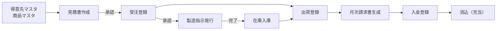

---

## フロー1: 認証・ロール管理 🔵

**信頼性**: 🔵 *REQ-001・REQ-002・REQ-011・REQ-012 より*

**関連要件**: REQ-001, REQ-002, REQ-011, REQ-012

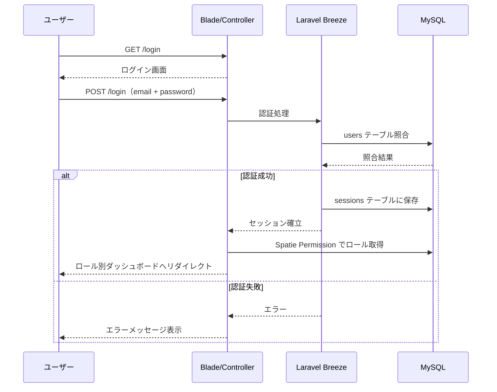

**ロール別リダイレクト先**:
- `admin` → `/dashboard/admin`（全体サマリー）
- `sales` → `/dashboard/sales`（見積・受注一覧）
- `manufacture` → `/dashboard/manufacture`（製造指示一覧）
- `warehouse` → `/dashboard/warehouse`（出荷待ち・在庫アラート）

---

## フロー2: 見積書作成・承認 🔵

**信頼性**: 🔵 *REQ-013〜REQ-026・US-010〜US-015・ヒアリングQ1・Q7 より*

**関連要件**: REQ-013, REQ-014, REQ-015, REQ-020, REQ-021, REQ-022, REQ-025, REQ-026

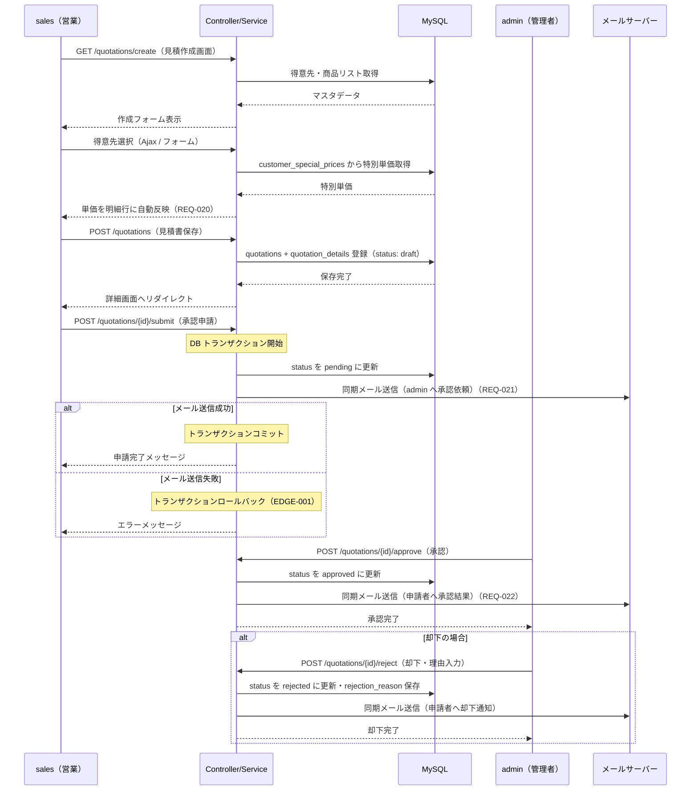

---

## フロー3: 受注登録・承認・製造指示自動発行 🔵

**信頼性**: 🔵 *REQ-016〜REQ-019・REQ-023〜REQ-025・US-016〜US-019・ヒアリングQ1・Q3・Q7・Q8 より*

**関連要件**: REQ-016, REQ-017, REQ-018, REQ-019, REQ-023, REQ-024, REQ-025

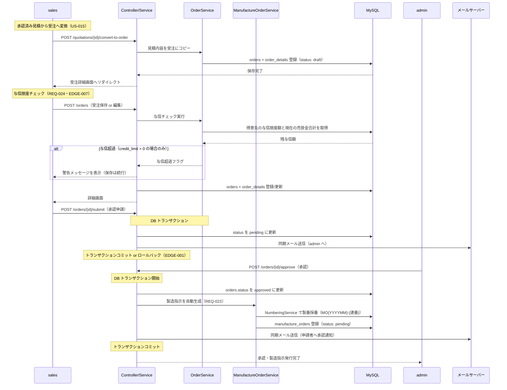

---

## フロー4: 製造指示・在庫入庫 🔵

**信頼性**: 🔵 *REQ-027〜REQ-029・REQ-035・US-021〜US-023・ヒアリングQ3 より*

**関連要件**: REQ-027, REQ-028, REQ-029, REQ-035, REQ-039

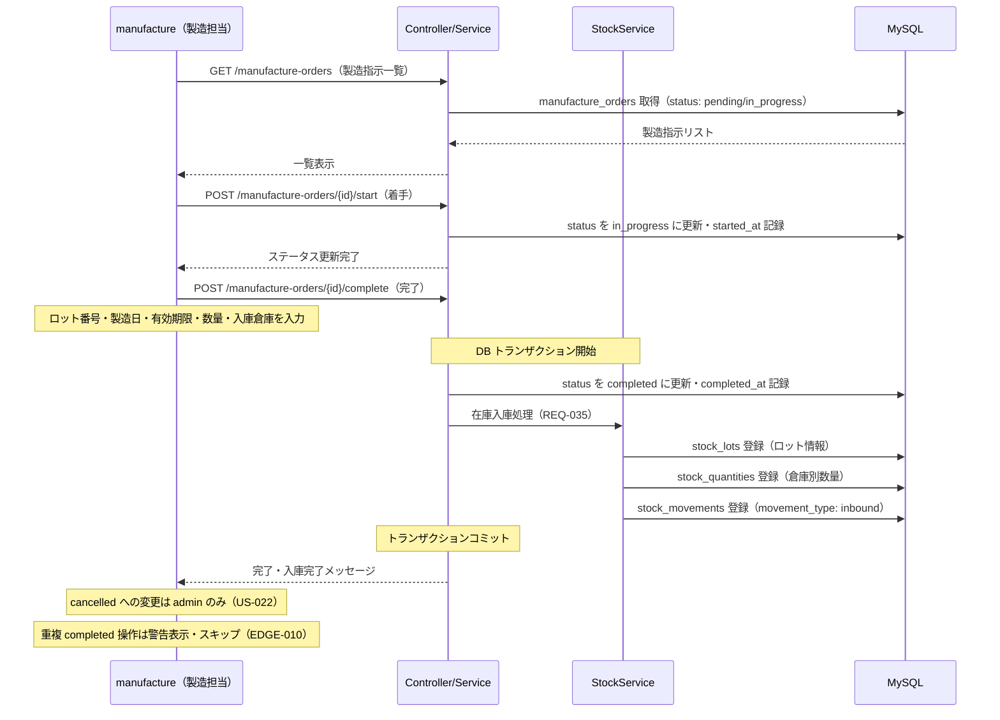

---

## フロー5: 出荷登録・在庫引当 🔵

**信頼性**: 🔵 *REQ-033・REQ-036・REQ-038・US-028・ヒアリングQ4 より*

**関連要件**: REQ-033, REQ-036, REQ-038, EDGE-002

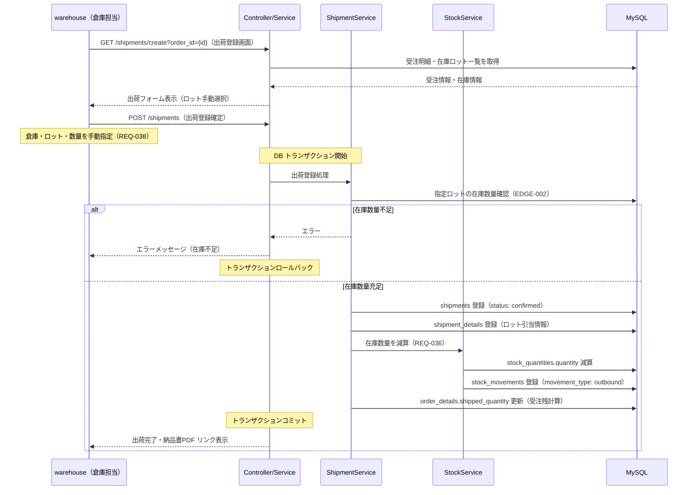

---

## フロー6: 返品処理 🔵

**信頼性**: 🔵 *REQ-034・REQ-037・US-030 より*

**関連要件**: REQ-034, REQ-037

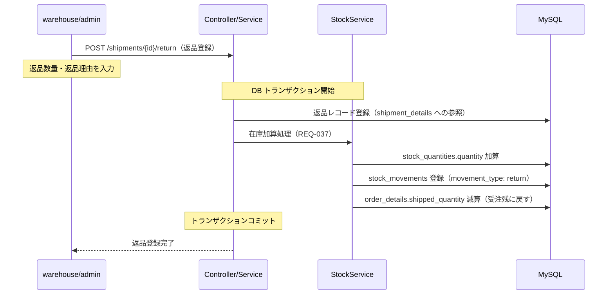

---

## フロー7: 月次請求書生成 🔵

**信頼性**: 🔵 *REQ-040・REQ-044・REQ-045・US-031・ヒアリングQ5 より*

**関連要件**: REQ-040, REQ-044, REQ-045, EDGE-004

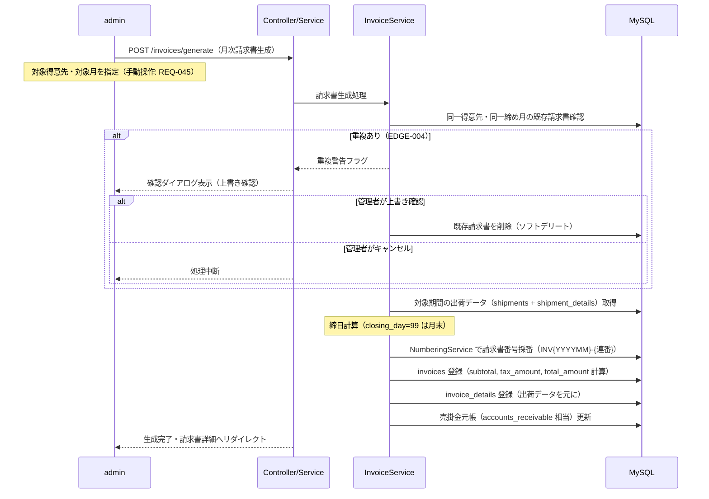

---

## フロー8: 入金登録・消込 🔵

**信頼性**: 🔵 *REQ-042・REQ-043・US-034・US-035・US-036・ヒアリングQ6 より*

**関連要件**: REQ-042, REQ-043, EDGE-005, EDGE-009

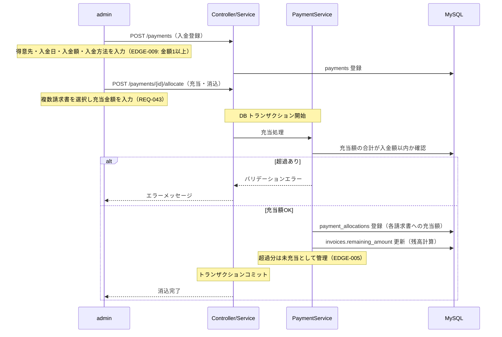

---

## フロー9: 在庫移動・棚卸調整 🔵

**信頼性**: 🔵 *REQ-030・REQ-031・REQ-032・US-026・US-027 より*

**関連要件**: REQ-030, REQ-031, REQ-032

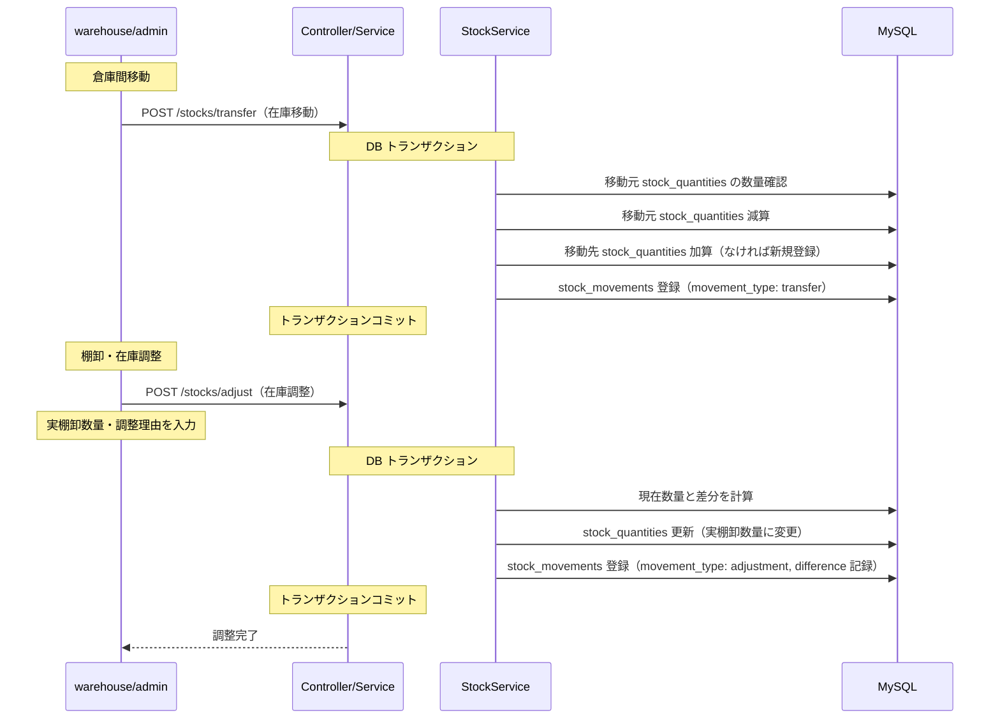

---

## フロー10: PDF 出力 🔵

**信頼性**: 🔵 *REQ-046〜REQ-048・REQ-052・REQ-053・ヒアリングQ2 より*

**関連要件**: REQ-046, REQ-047, REQ-048, REQ-052, REQ-053, EDGE-003

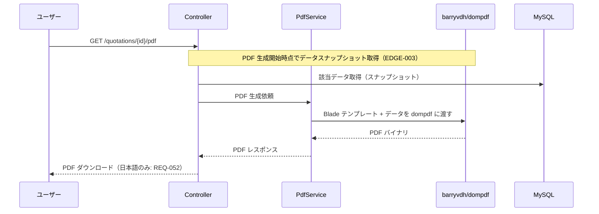

**PDF 対象**:
- 見積書 PDF: `GET /quotations/{id}/pdf`
- 納品書 PDF: `GET /shipments/{id}/pdf`
- 請求書 PDF: `GET /invoices/{id}/pdf`

---

## データ状態遷移

### 見積書・受注ステータス遷移 🔵

**信頼性**: 🔵 *REQ-015・REQ-017・REQ-025・REQ-026 より*

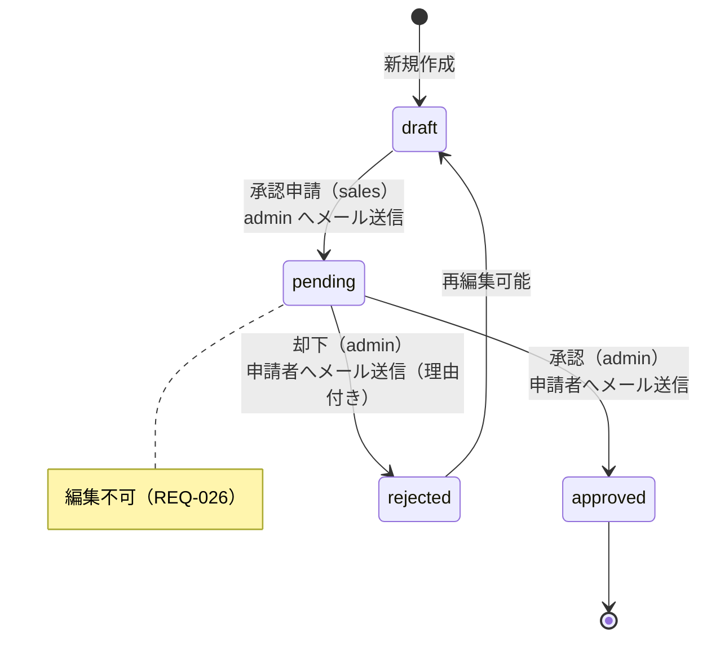

### 製造指示ステータス遷移 🔵

**信頼性**: 🔵 *REQ-027・US-022 より*

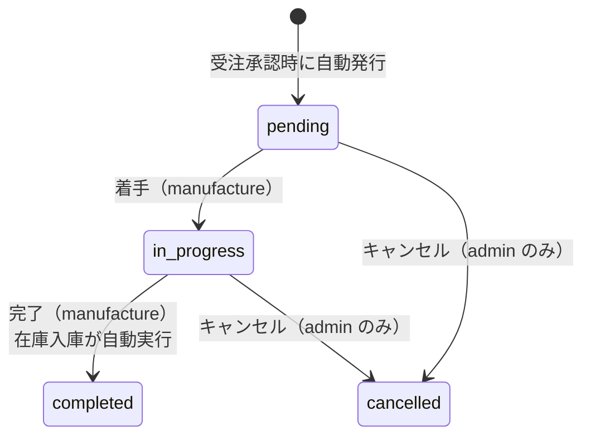

---

## エラーハンドリングフロー 🔵

**信頼性**: 🔵 *EDGE-001〜EDGE-010・REQ-059 より*

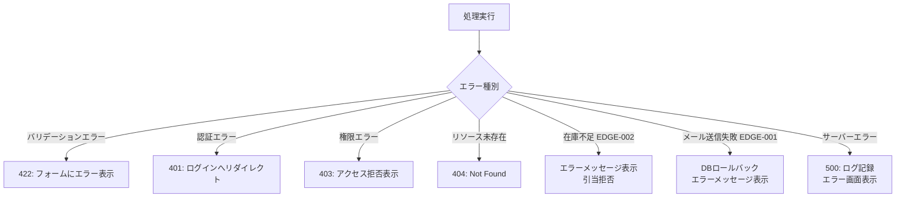

---

## 関連文書

- **アーキテクチャ**: [architecture.md](architecture.md)
- **DBスキーマ**: [database-schema.sql](database-schema.sql)
- **Webルート仕様**: [api-endpoints.md](api-endpoints.md)
- **要件定義**: [requirements.md](../../spec/manufacturing-sales-mgmt/requirements.md)

---

## 信頼性レベルサマリー

- 🔵 青信号: 20件 (100%)
- 🟡 黄信号: 0件 (0%)
- 🔴 赤信号: 0件 (0%)

**品質評価**: ✅ 高品質
